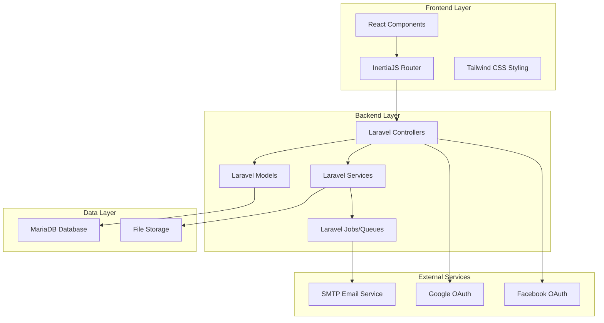
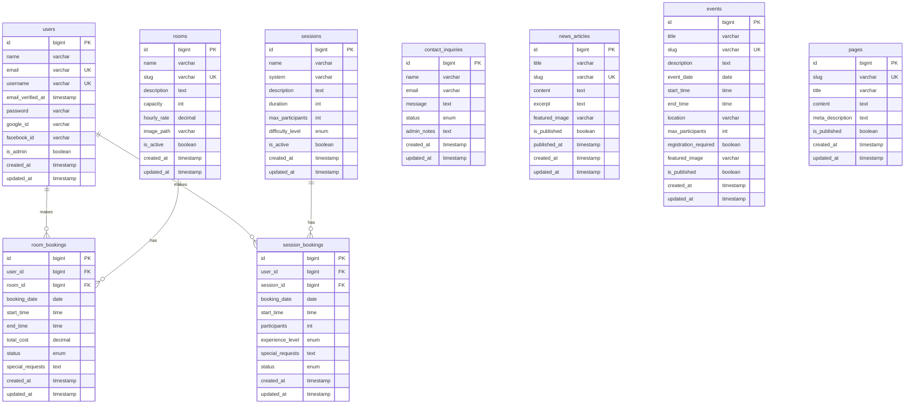

# Design Document

## Overview

The Adventurers' Hall website will be built as a modern, responsive web application using Laravel 11 as the backend API and administrative framework, React 18 for the frontend user interface, and InertiaJS for seamless page transitions without the complexity of a separate API. The application will use MariaDB for data persistence and follow a component-based architecture with clear separation of concerns.

The design emphasizes user experience with a cohesive black, pink, and white theme, intuitive navigation, and streamlined booking processes. The system will support both traditional authentication and social login integration, with comprehensive email notifications and an administrative interface for content management.

## Architecture

### High-Level Architecture



### Technology Stack

- **Backend**: Laravel 11 (PHP 8.2+)
- **Frontend**: React 18 with TypeScript
- **Bridge**: InertiaJS for SPA-like experience
- **Database**: MariaDB 10.6+
- **Styling**: Tailwind CSS with custom theme
- **Authentication**: Laravel Sanctum + Socialite
- **Email**: Laravel Mail with SMTP
- **Build Tools**: Vite for asset compilation
- **Queue System**: Laravel Queues for email processing

## Components and Interfaces

### Frontend Components Structure

```
resources/js/
├── Components/
│   ├── Layout/
│   │   ├── AppLayout.tsx
│   │   ├── GuestLayout.tsx
│   │   ├── AdminLayout.tsx
│   │   └── Navigation.tsx
│   ├── UI/
│   │   ├── Button.tsx
│   │   ├── Input.tsx
│   │   ├── Modal.tsx
│   │   ├── Card.tsx
│   │   └── DatePicker.tsx
│   ├── Booking/
│   │   ├── RoomBookingForm.tsx
│   │   ├── SessionBookingForm.tsx
│   │   ├── AvailabilityCalendar.tsx
│   │   └── BookingConfirmation.tsx
│   ├── Auth/
│   │   ├── LoginForm.tsx
│   │   ├── RegisterForm.tsx
│   │   ├── SocialLogin.tsx
│   │   └── ForgotPassword.tsx
│   └── Admin/
│       ├── ContentEditor.tsx
│       ├── BookingManager.tsx
│       ├── ContactInquiries.tsx
│       └── UserManager.tsx
├── Pages/
│   ├── Home.tsx
│   ├── About.tsx
│   ├── Contact.tsx
│   ├── BookRoom.tsx
│   ├── BookSession.tsx
│   ├── News.tsx
│   ├── Events.tsx
│   ├── Auth/
│   └── Admin/
└── Types/
    ├── index.ts
    ├── booking.ts
    ├── user.ts
    └── content.ts
```

### Backend Structure

```
app/
├── Http/
│   ├── Controllers/
│   │   ├── HomeController.php
│   │   ├── BookingController.php
│   │   ├── ContactController.php
│   │   ├── AuthController.php
│   │   ├── SocialAuthController.php
│   │   └── Admin/
│   ├── Requests/
│   │   ├── BookingRequest.php
│   │   ├── ContactRequest.php
│   │   └── AuthRequest.php
│   └── Middleware/
│       ├── AdminMiddleware.php
│       └── HandleInertiaRequests.php
├── Models/
│   ├── User.php
│   ├── Room.php
│   ├── RoomBooking.php
│   ├── Session.php
│   ├── SessionBooking.php
│   ├── ContactInquiry.php
│   ├── NewsArticle.php
│   ├── Event.php
│   └── Page.php
├── Services/
│   ├── BookingService.php
│   ├── EmailService.php
│   ├── ContentService.php
│   └── AvailabilityService.php
├── Jobs/
│   ├── SendBookingConfirmation.php
│   ├── SendContactConfirmation.php
│   └── SendWelcomeEmail.php
└── Mail/
    ├── BookingConfirmation.php
    ├── ContactConfirmation.php
    └── WelcomeEmail.php
```

## Data Models

### Database Schema



### Model Relationships

- **User Model**: Has many room bookings, session bookings
- **Room Model**: Has many room bookings, includes availability logic
- **Session Model**: Has many session bookings, includes system information
- **Booking Models**: Belong to user and respective resource (room/session)
- **Content Models**: Independent models for CMS functionality

## Error Handling

### Frontend Error Handling

```typescript
// Global error boundary for React components
class ErrorBoundary extends Component {
    // Handle React component errors
}

// Inertia error handling
router.on('error', (errors) => {
    // Display validation errors
    // Handle authentication errors
    // Show network connectivity issues
})

// Form validation errors
const handleSubmit = (data) => {
    router.post('/bookings', data, {
        onError: (errors) => {
            setErrors(errors)
        }
    })
}
```

### Backend Error Handling

```php
// Custom exception handling
class BookingException extends Exception {}
class AvailabilityException extends Exception {}

// Global exception handler
class Handler extends ExceptionHandler {
    public function render($request, Throwable $exception) {
        if ($request->header('X-Inertia')) {
            // Return Inertia error responses
        }
        return parent::render($request, $exception);
    }
}

// Service layer error handling
class BookingService {
    public function createBooking($data) {
        try {
            // Booking logic
        } catch (AvailabilityException $e) {
            throw new BookingException('Room not available');
        }
    }
}
```

### Error Types and Responses

1. **Validation Errors**: Return 422 with field-specific messages
2. **Authentication Errors**: Redirect to login with intended URL
3. **Authorization Errors**: Return 403 with appropriate message
4. **Booking Conflicts**: Return specific availability information
5. **Email Failures**: Log error but don't block user action
6. **Database Errors**: Log and return generic error message

## Testing Strategy

### Frontend Testing

```typescript
// Component testing with React Testing Library
describe('BookingForm', () => {
    test('validates required fields', () => {
        // Test form validation
    })
    
    test('submits booking data', () => {
        // Test form submission
    })
})

// Integration testing with Inertia
describe('Booking Flow', () => {
    test('completes room booking process', () => {
        // Test full booking workflow
    })
})
```

### Backend Testing

```php
// Feature tests for booking system
class BookingTest extends TestCase {
    public function test_user_can_book_available_room() {
        // Test successful booking
    }
    
    public function test_booking_prevents_double_booking() {
        // Test availability validation
    }
    
    public function test_booking_sends_confirmation_email() {
        // Test email notifications
    }
}

// Unit tests for services
class BookingServiceTest extends TestCase {
    public function test_calculates_booking_cost_correctly() {
        // Test business logic
    }
}
```

### Testing Approach

1. **Unit Tests**: Service classes, model methods, utility functions
2. **Feature Tests**: Complete user workflows, API endpoints
3. **Component Tests**: React component behavior and rendering
4. **Integration Tests**: Database interactions, email sending
5. **E2E Tests**: Critical user paths (booking, authentication)

### Test Coverage Goals

- **Backend**: 80% code coverage minimum
- **Frontend**: 70% component coverage minimum
- **Critical Paths**: 100% coverage (booking, authentication, payments)

## Theme Implementation

### Color Palette

```css
:root {
    /* Primary Colors */
    --color-black: #000000;
    --color-pink: #ec4899;
    --color-white: #ffffff;
    
    /* Shades and Tints */
    --color-gray-900: #111827;
    --color-gray-800: #1f2937;
    --color-gray-100: #f3f4f6;
    --color-pink-50: #fdf2f8;
    --color-pink-100: #fce7f3;
    --color-pink-500: #ec4899;
    --color-pink-600: #db2777;
    --color-pink-700: #be185d;
}
```

### Tailwind Configuration

```javascript
module.exports = {
    theme: {
        extend: {
            colors: {
                primary: {
                    50: '#fdf2f8',
                    500: '#ec4899',
                    600: '#db2777',
                    700: '#be185d',
                },
                dark: {
                    800: '#1f2937',
                    900: '#111827',
                }
            },
            fontFamily: {
                'display': ['Cinzel', 'serif'],
                'body': ['Inter', 'sans-serif'],
            }
        }
    }
}
```

## Security Considerations

### Authentication Security

- Password hashing with bcrypt
- CSRF protection on all forms
- Rate limiting on login attempts
- Secure session management
- OAuth token validation

### Data Protection

- Input validation and sanitization
- SQL injection prevention via Eloquent ORM
- XSS protection with proper escaping
- File upload restrictions and validation
- Secure email template rendering

### Admin Panel Security

- Role-based access control
- Admin-only middleware protection
- Audit logging for admin actions
- Secure file upload handling
- Content sanitization for rich text

## Performance Optimization

### Frontend Performance

- Code splitting by route
- Lazy loading of components
- Image optimization and lazy loading
- Caching of static assets
- Minimal bundle size with tree shaking

### Backend Performance

- Database query optimization
- Eager loading of relationships
- Redis caching for frequently accessed data
- Queue processing for emails
- Database indexing strategy

### Caching Strategy

- Page caching for static content
- Query result caching
- Session-based user data caching
- Asset versioning and CDN integration